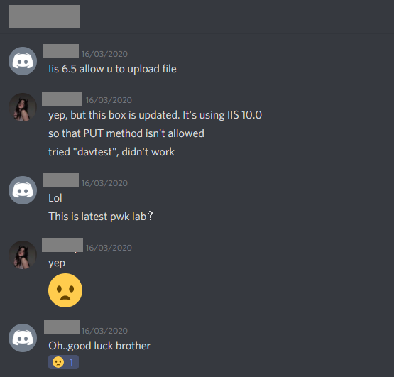

# My OSCP Journey

## Disclaimer
Hello everyone, This blog contains information about my OSCP journey and a little Myth busting. If you are here looking for some awesome exam cheat-sheets and hundreds of links for learning resources, you might be looking at the wrong place.

## Who am I?
I am Shashank, a 19 years old noob InfoSec guy, programmer and an independent learner. I wanna share my experience of OSCP exam with aspiring people. I wanted to write this blog to bust some Myths that people have about OSCP.

## What is OSCP?
This section is for the readers who have no idea what an OSCP is. OSCP stands for <b>Offensive Security Certified Professional</b>.
It is one of the most reputed, expensive, Demanded, hands on Cyber Security certification exam conducted by Offensive Security(The company which created the infamous Kali Linux, Backtrack, Exploit-db). Just imagine being certified by a company which ignited the world of Hacking on earth. It tests your practical "Hacking" skills in various manual exploitation techniques like Web application client and server side attacks, privilege escalation attacks, post exploitation attacks, reverse engineering etc. You can find more information about this exam [here](https://www.offensive-security.com/pwk-oscp/?utm_source=adwords&utm_term=oscp&utm_campaign=&utm_medium=ppc&hsa_mt=b&hsa_ad=416888275134&hsa_net=adwords&hsa_src=g&hsa_kw=oscp&hsa_tgt=kwd-304102459&hsa_cam=9268290411&hsa_acc=7794287291&hsa_ver=3&hsa_grp=92754783343&gclid=Cj0KCQjw1Iv0BRDaARIsAGTWD1uiTjvrxXyuI0gnIr5OxfoYbZOjBNKxwTIDHd8fcQk7bV2u27c0DJQaAtf9EALw_wcB). 

## About OSCP Exam
OSCP exam consists of a network of 5 linux/windows systems which you need to compromise("Hack") within 24 hours in order to get your OSCP designation(certification).
The systems carry a total of 100 marks which are divided in the following way:
* 2 Machines of 25 marks each (HARD)
* 2 Machines of 20 marks each (MEDIUM)
* 1 Machine of 10 marks (EASY)
Out of 100, you need to score at least 70 marks in order to pass the exam. Once you are done with the exam, you are required to submit a mandatory report on exam machines which should contain technical/logical details about how you approached the system, how you came across a technique to exploit it, and how you gained access to it.

## My Journey in very brief
In my first year of college, I knew nothing outside basic Reverse Engineering in linux and programming. One day I met a guy who introduced me to other cyber security stuff and this glorius certification. From that day, It became my goal in life to clear this exam. I started by learning basics of Networking and Linux from [Cybrary](https://www.cybrary.it/). Once I was done with that, I began doing free and pirated security related courses available online. Armed with the basics skills, I started doing seurity challanges in websites like [Vulnhub](https://www.vulnhub.com/) and [HackTheBox VIP](https://www.vulnhub.com/).
After a year, I was done with enough of machines, I bought the PWK(<b>Penetration Testing with Kali Linux</b>, Official course for OSCP certification) with only one month of lab access as I couldn't afford more than that. Did hard work there, and finally got my certification.

## My PWK Lab experience and exam:
Most of you are already aware about the new updated PWK 2020. Since most of the machines are updated, old forums are invalid for new boxes, so an entirely new PWK 2020 forum section is created. But sadly, not much people were enrolled in the new PWK. So there were less people and less threads related to boxes on the forum. My friends who were OSCP holders were not able to help me as they haven't done the updated machines. So I was all on my own. You can imagine from the below screenshot.



## Myth Busting
And here comes the main part for which I have written this blog, Myth Busting.
### Myth #1: You need to be an expert an expert in "Hacking" to clear this exam
It depends on how everyone defines the word "expert". It certainly doesn't reuire people to be an expert in the field of cyber security as it is the most introductory certification in series of Offensive Security exams, but it actually requires you to know the underlying techniques behind attacks as the exam is focused on non-automated(manual) exploitation.

### Myth #2: Make sure you do the "Big 4"(Pain, Ghost, Humble, Sufference) before appearing for the exam
First of all, I don't even know why "Pain" is in the list of "Big-4" as it was too ezpz. For the rest, no you don't need to solve them. I didn't! They were too much CTFish and unrealistic. OSCP exam is based on real life exploitation approach where you don't find machines like Sufference or Humble. So you do not need to worry.

### Myth #3: You need to do at least 40 machines in PWK labs before you schedule your exam
Not true, It doesn't matter how many machines have you done. I have seen people who did more than 50 boxes in HackTheBox and more than 50 machine in PWK labs, still failed. I just did 28 boxes out of 75 in 20 days and gave exam, rooted all machines.

### Myth #4: 24 hours are too less for popping 5 machines
I finished my exam in 10 hours. Many of my friends did it in 12-15 hours. So yea, the time is enough to finish the exam.

### Myth #5: All PWK machines have changed in PWK2.0
Some machines have been changed, some have been slightly modified(new privesc method, new panel etc) and many new machines including the AD ones have been introduced.

### Myth #6: Atleast 2 months of PWK lab is necessary
If you are willing to solve all 70+ machines in the lab, then yes! You will be needing 2 months to do that in my opinion. But if your aim is to do sufficient enough to clear the OSCP exam, one month is more than sufficient. As I already told, I only did 28 boxes and still passed.

### Myth #7: You must be having sound understanding of Active Directory pentesting
Now this one is bit tricky for me to answer. I bought the new PWK 2.0 just after few days of it's release. Back then, I had no skills in AD pentesting. This made me thought that I won't be able to do AD boxes and eventually fail in exam. Luckily, AD machines are not there in the OSCP exam as the offsec itself has said that only PWK course and lab has been modified, exam remains the same for now. But please stay awake, nobody knows when the exam is going to be modified. So, just to play safe, It's a good idea to learn Active Directory pentesting before jumping to PWK even if it is not asked in exam, because it's still a nice skill to have. 

### Myth #8: You must have high speed internet to appear in exam
Offsec says that 5mbps(and not 5mBps) is enough for exam. I gave my exam in 8mbps. Even if you have high speed internet at your place, it's not that much of a concern. What actually matters is the stability. On the day of exam, Internet connection must be stable(must not be having very high fluctuations). 
Also, you might be worried about your connectivity speed thinking that 
* Your front camera will stream for 24 hours consuming a lot of bandwidth
* VPN will be active
* You will connect to remote desktop for BOF box which will consume bandwidth

I too thought the same and was worried if I will get enough internet speed for doing things like enumeration, directory bruteforcing etc in the exam. But 8mbps turned out to be more than required. So, I would say it again. Stability matters more than speed.

### Myth #9: Using applications like cherry-tree to stay organized and note-taking is necessary
I read this tip in every OSCP writeup but I believe it's not important. In my exam, I didn't use any such tool for taking notes or I should say, I didn't even made notes :-p 
I have a new approach for you guys, take mine:

> Take screenshots in such a way that they alone are sufficient to reproduce the exploitation steps

At the end of my exam, I looked at my screenshots and they were sufficient for somebody to know what and how I exploited the vulnerability and got shell. So, instead of taking screenshot and writing stuff about what you found and how you found, simply take screenshot of that and then later you can add some bits about that screenshot in your report.

Here is how I save screenshots:

```1_found_vulnerable_cms.jpg```


```2_found_upload_directory_with_dirbuster.jpg```


```3_uploaded_php_reverse_shell.jpg```


```4_listening_on_netcat_4444.jpg```


```5_shell_arrived.jpg```


```6_ifconfig_output_and_flag.jpg```

Notice the two parts of the screenshot here
* First is the sequence number to not mess the steps up
* Second part is the descriptive name of what the screenshot is about

As can be seen, my screenshot or the name of screenshot is enough for somebody to know what and how to exploit it.

### Myth #10: Have a good night sleep and relax before the day of your exam
Now this can vary in every human being but let me tell you my case. I too read the same advice in articles and went to sleep early. But due to my weird sleep schedule and nervousness of the exam on next day, I couldn't sleep the entire night and appeared in the exam just after 4 hours of sleep. And you already know what happened next. I won't say it's a wrong advice, it's indeed helpful. I just wanna point out that it's not necessary.

### Myth #11: You can only use the modified kali image that comes with PWK course in exam.
No, Many of my friends and I myself gave exam on Parrot OS and didn't have any issues. It actually doesn't matter what OS are you using. Before the start of your exam, proctor gives you a shell script to run and paste output on his screen. Once he has the output, proctor makes sure you are not doing any monkey business beneath or having any connectivity issues. It really doesn't matter which linux distribution you are using.
